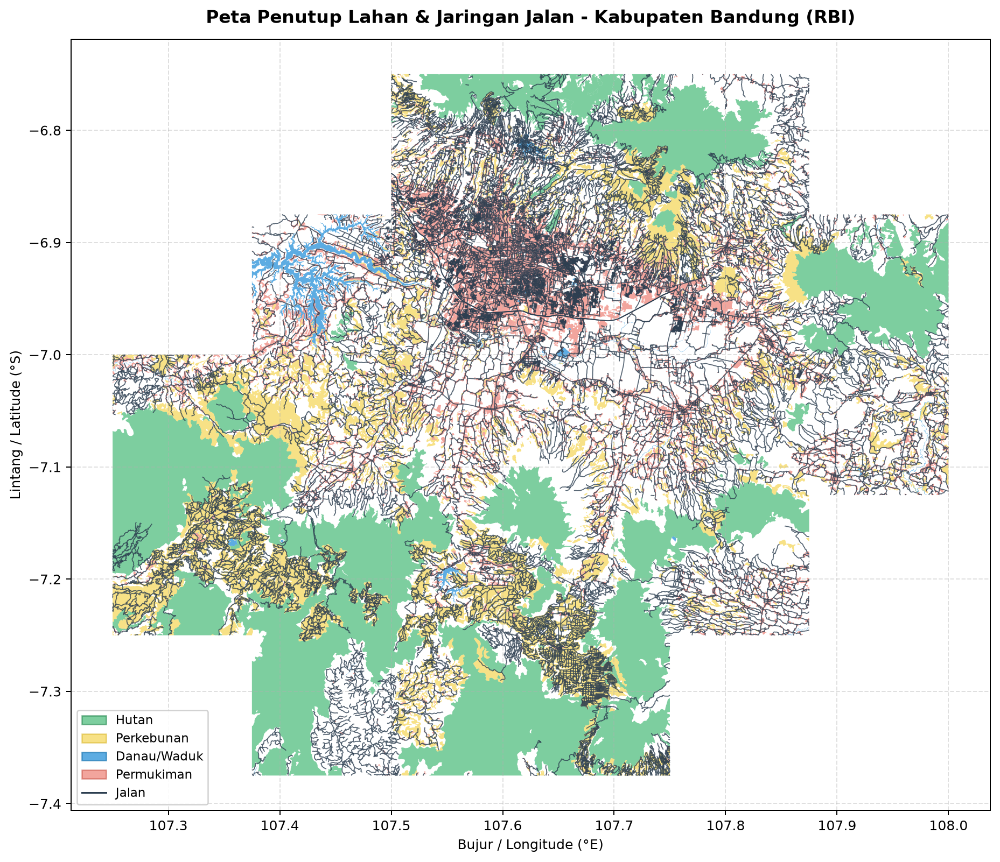
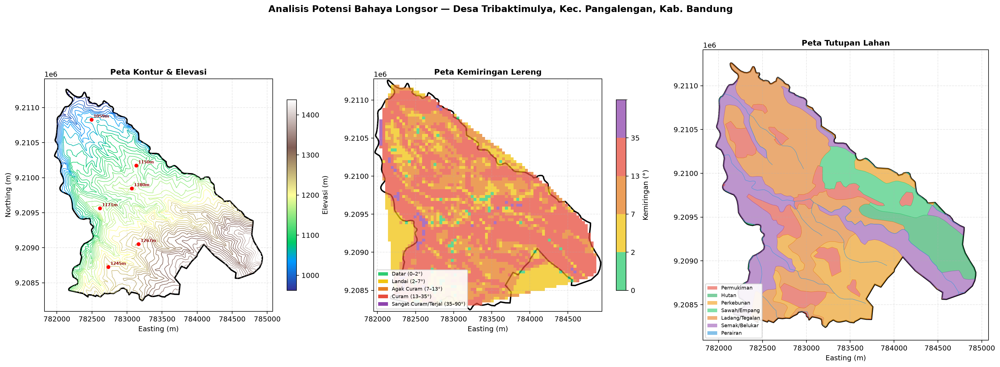
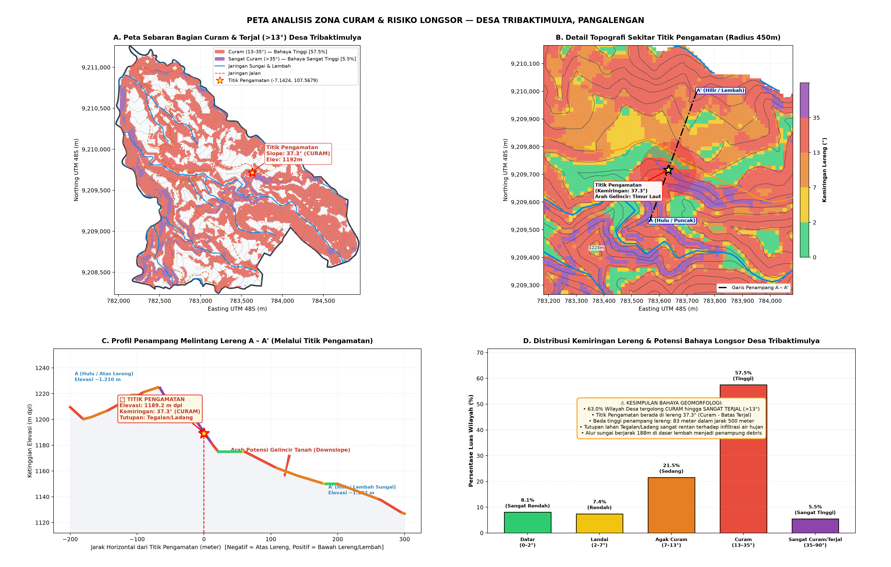

# Landslide Early Warning System (EWS) - STASRG

Sistem Peringatan Dini Tanah Longsor (Landslide EWS) terintegrasi yang menggunakan ESP32 dengan sensor IMU dan Piezo, dilengkapi analisis spasial GIS (Rumus Bencana Indonesia) dan deteksi anomali berbasis *Machine Learning*.

## Arsitektur Sistem

1. **Hardware (ESP32)**: Membaca data *tilt* (kemiringan), *rotation* (rotasi), *gravity drift*, dan *piezo vibration*. Data difilter dan dikirim via Serial USB atau WiFi (MQTT).
2. **Serial Bridge (Python)**: Script perantara yang membaca data dari port Serial USB dan mengirimkannya (via HTTP POST) ke Node-RED.
3. **Middleware (Node-RED)**: Menerima data JSON dari Python/MQTT, menerjemahkannya ke dalam dashboard UI secara *real-time*, memformat struktur data, lalu meneruskannya ke InfluxDB.
4. **Database (InfluxDB v2)**: Menyimpan seluruh log data secara historis (*time-series*).
5. **Machine Learning (Python)**: Deteksi anomali menggunakan Isolation Forest pada data sensor untuk klasifikasi risiko longsor.
6. **GIS / Analisis Spasial (Python)**: Modul analisis kerentanan longsor berbasis Rumus Bencana Indonesia (RBI), menghasilkan peta zona risiko.

## Prasyarat (Prerequisites)

Untuk menjalankan proyek ini di perangkat baru, pastikan Anda telah menginstal:
- [Arduino IDE](https://www.arduino.cc/en/software) (Untuk *flashing* ESP32)
- [Python 3.x](https://www.python.org/downloads/)
- [Node-RED](https://nodered.org/docs/getting-started/local)
- [InfluxDB v2](https://docs.influxdata.com/influxdb/v2.0/install/) (Jika di Mac: `brew install influxdb@2`)

## Struktur Repositori

- `firmware/arduino_usb/`: Kode sumber utama ESP32 (Arduino IDE) — koneksi Serial USB.
- `firmware/arduino_mqtt/`: Kode sumber ESP32 (Arduino IDE) — koneksi WiFi + MQTT. Lihat [Panduan MQTT](docs/MQTT_UPGRADE.md).
- `firmware/platformio_usb/`: Kode sumber ESP32 menggunakan PlatformIO.
- `firmware/wokwi_simulation/`: Berkas simulasi Wokwi.
- `python/`: Serial bridge, ML engine (Isolation Forest), data simulator, dan model terlatih.
- `gis/`: Modul analisis spasial GIS — RBI engine, visualisasi peta, dan boundary GeoJSON.
- `node-red/`: Berkas konfigurasi alur Node-RED (Dashboard & InfluxDB).
- `docs/`: Dokumentasi tambahan dan gambar peta analisis.

---

## Panduan Instalasi dan Konfigurasi

### 1. Konfigurasi Hardware (ESP32)
- Buka folder `firmware/arduino_usb` dengan Arduino IDE.
- Pastikan library **SparkFunLSM6DS3** sudah terinstal di *Library Manager*.
- Sambungkan ESP32 Anda, pilih Board dan Port yang sesuai, lalu klik **Upload**.
- *(Opsional)*: Anda bisa memverifikasi apakah sensor berfungsi dengan membuka *Serial Monitor* (Baud rate: 115200). 
- **Penting:** Tutup Serial Monitor sebelum menjalankan sistem utama, karena port hanya bisa digunakan oleh satu aplikasi dalam satu waktu.

### 2. Setup Node-RED
1. Jalankan Node-RED (`node-red` di terminal).
2. Buka antarmuka Node-RED di browser: `http://localhost:1880`.
3. Instal *palette/node* tambahan berikut melalui menu **Manage Palette**:
   - `node-red-dashboard`
   - `node-red-contrib-influxdb`
4. Lakukan **Import** (Menu -> Import) dan pilih file `node-red/landslide_flow.json` dari repositori ini.
5. Klik 2x pada node InfluxDB (`influxdb out`), edit servernya, dan **masukkan API Token InfluxDB Anda**.
6. Klik tombol merah **Deploy** di kanan atas layar.

### 3. Setup Python Serial Bridge
Script Python berfungsi menghubungkan ESP32 ke Node-RED. Anda disarankan menggunakan *Virtual Environment* (venv).
```bash
cd python
python3 -m venv venv
source venv/bin/activate  # Untuk Linux/Mac
# venv\Scripts\activate   # Untuk Windows
pip install -r requirements.txt
```
Sesuaikan nama *port* di dalam file `serial_bridge.py` jika diperlukan (misalnya mengubah `/dev/cu.usbserial-xxx` menjadi `COM3` di Windows).

---

## Cara Menghidupkan Sistem (Startup)

Untuk pengguna Mac/Linux, kami telah menyediakan *shortcut script* agar sistem bisa dihidupkan dengan cepat. 

1. Pastikan ESP32 sudah tercolok ke USB.
2. Jalankan script `Start_IoT_System.command` (atau jalankan `python3 serial_bridge.py` secara manual).
3. Buka tautan pemantauan di browser Anda:
   - **Dashboard Real-time**: `http://localhost:1880/ui`
   - **Database Explorer**: `http://localhost:8086`

## Troubleshooting

- **Data tidak muncul di InfluxDB?**
  1. Pastikan Anda telah menekan tombol *Refresh* (browser) di Node-RED setelah mengatur API token.
  2. Pastikan InfluxDB *Organization* (`iot_project`) dan *Bucket* (`landslide_data`) sudah dibuat sebelumnya di antarmuka web InfluxDB.
- **Port Busy / Access Denied?**
  Pastikan Anda telah menutup Arduino Serial Monitor sebelum menjalankan script Python.

---

## Modul Machine Learning

Modul ML menggunakan **Isolation Forest** untuk mendeteksi anomali pada data sensor secara otomatis.

```bash
cd python
python3 -m venv venv && source venv/bin/activate
pip install -r requirements.txt

# Simulasi data (opsional)
python3 data_simulator.py

# Training model
python3 train_model.py

# Menjalankan ML engine
python3 ml_engine.py
```

Model terlatih tersimpan di `python/models/`.

---

## Modul GIS — Analisis Kerentanan Longsor (RBI)

Modul analisis spasial berbasis **Rumus Bencana Indonesia (RBI)** untuk menghitung indeks kerentanan longsor di wilayah Tribaktimulya, Kabupaten Bandung.

```bash
cd gis
pip install -e .   # install dari pyproject.toml

# Menjalankan demo analisis RBI
python3 run_demo.py

# Visualisasi peta
python3 visualize_map.py

# Analisis lengkap
python3 analisis_longsor_tribaktimulya.py
```

Konfigurasi parameter RBI bisa disesuaikan di `gis/rbi_config.yaml`.

### Contoh Peta Analisis

| Peta Kabupaten Bandung | Analisis Tribaktimulya | Zona Kemiringan Curam |
|:-:|:-:|:-:|
|  |  |  |

---
*Proyek ini dikembangkan untuk kebutuhan riset dan sistem peringatan dini kebencanaan.*

